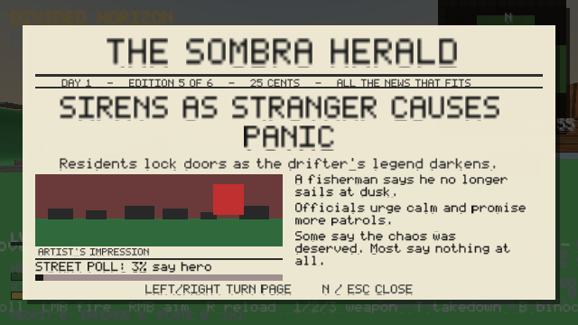

# M11 — Legend: Stature + the Herald

## What shipped
- **Stature (Spec §26.4):** a hidden −100..+100 slider that is never shown as a number. It moves by comparing the game's existing lifetime tallies from frame to frame, so no other system needed new hooks.
  - Pushes toward hero: stealth capture +6, loud capture +2, mast +3, job +1.5, mission +4, Poncho freed +3.
  - Pushes toward renegade: kill −0.6, alarm −3, each wanted star −2.
- **Five tiers:** Public Menace / Loose Cannon / Unknown Quantity / Local Hope / Folk Hero.
- **Five observable reactions:**
  1. Vendor prices change by ±5% per tier (`Progress.price_k` inside `prog_price`).
  2. Heroes lose the cops faster: the heat escape clock gets +25% per hero tier.
  3. Meridian pedestrians comment on you as you pass (15 lines, a 20 s cooldown).
  4. The Herald's headline tone and a "street poll" bar on every page reflect your stature.
  5. The ending front page is written in the tone of your stature.
- **The Herald (Spec §27):**
  - Front pages are printed for these events: arrival, stealth capture, loud capture, mast, alarm, 3★, 5★, mission, body-count milestones, Poncho, jobs, ferry and ending.
  - Headlines come from 13 templates × 3 tones × 2 variants, and each page gets a seeded "artist's impression" panel.
  - An EXTRA! banner appears for new pages. Press **N** to open the scrapbook, which holds up to 24 pages and pauses the game while open.
  - Pages are saved as flags (template, tone, day, value, seed), so the text is identical after loading, and loading a save doesn't print the old deeds again.

## Tests
New suite `smoke_legend.c` with 33 checks. Full suite **795/795**. The Win64 exe is 817,664 B and the zip is 368 KB.

## Honest limits
- Headlines are chosen from written templates, not generated text. Pedestrian comments are text only; there is no voice.
- The pictures are simple block drawings, not rendered captures of the actual scene.
- Stature doesn't yet change mission dialogue or spawn behaviour.
- Carried-over gaps are unchanged (see M10): box cars, no SWAT, pedestrians never die, 1 of 12 outposts, no bosses or voice, no GPU measurement.
