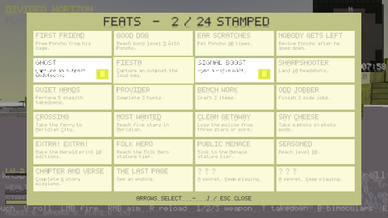

# M12 — Feats Poster Wall (Spec §53)

**Status:** done. Suite 818/818 (new suite 11 `smoke_feats`, 23 checks).

## What shipped
- `game/src/game/feats.inl`: **24 feats, 2 of them secret**. Each one is a check on live game state (Poncho bond/pets/revives/distracts, outpost style, masts, headshots, takedowns, hunts, crafts, jobs, ferry, 5 stars, clean getaway, photos, Herald editions, stature tier, level, missions, ending).
- Checked twice a second; **one stamp per check** so toasts never pile up. Each stamp gives +50 XP and a card SFX, and shows a wax-seal toast that slams down. The toast only scales, with no flashing, so it is safe for photosensitive players.
- **J** opens the poster wall: a 4×6 card grid with arrow-key selection and a counter. The game is paused while it's open. Secret feats show "? ? ?" until you earn them.
- Clean Getaway tracks your highest star level and fires when heat drops back to 0 from 3 stars or more.
- Stamps are saved as the bitmask save flag `feats`.

## Honest gaps
- There is no Steam or platform integration; feats exist only inside the game (the game is DRM-free and works offline).
- The spec's feats that depend on missing systems (bosses, stunts, the disguise run) aren't included. They will be added when those systems exist.
- The wax seal is made of stacked quads, not a sprite.
- In the headless software-render screenshots, colours come out lighter than intended. The Herald page renders the same way, so this is an existing quirk of the screenshot path, not something new in this milestone.
