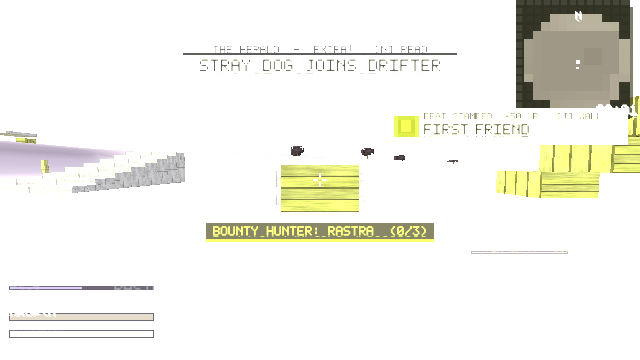

# M13 — Los Cobradores bounty squad (Spec §26.2)

## What shipped
- `game/src/game/cobradores.inl`: four named bounty hunters who come after you once your **Infamy** is high enough.
  - Infamy comes from your lifetime tallies (kills ×1, alarms ×4, loud outposts ×6, loud shots ×0.1, heat stars ×3). It drops slowly over time, and by 20 every time you beat a hunter. Hunters come at 30. After each encounter there's a 150 s cooldown.
  - **RASTRA** (tracker) shows up behind you. Once Poncho is free, he growls 3 s before she arrives.
  - **VIDENTE** (marksman) is an officer who spawns 45 m out.
  - **PULPO** (brawler) is a bruiser who brings two grunts.
  - **LUCKY** (charmer) walks up calm and turns hostile inside 5 m.
  - Beating a hunter wounds them. They come back later with a scar (+25% HP each time). The third defeat is final and the Herald prints an obituary (new templates HT_OBIT / HT_SQUAD, `@` = hunter name).
  - If you get 120 m away or last 120 s, the hunter withdraws and it doesn't count as a defeat.
  - When all four have fallen: Lucky's coin trinket, +8 stature, a Herald front page, and the squad stops coming.
  - HUD bounty bar with the hunter's name, defeat count and health. Each hunter has an arrival bark for every encounter.
  - Hunters show up in both Isla Sombra and Meridian.
- Two new feats: COLLECTION REFUSED and LUCKY'S COIN (26 in total).
- Saves keep each hunter's defeat count, the trinket and your Infamy.

## Tests
New suite 12, `smoke_bounty` (39 checks). The full suite has **12/12 suites passing** (857 checks). The Windows exe was rebuilt and the zip is 383 KB.

 (the headless soft-render PNG looks washed out; this is a known problem that was already there before M13)

## What's missing
Hunters use the existing three enemy meshes: no custom models, no voice, and they aren't tinted in the world. Spawn spots are placed relative to the player and don't use pathfinding. Most other game systems don't react to Infamy yet.
