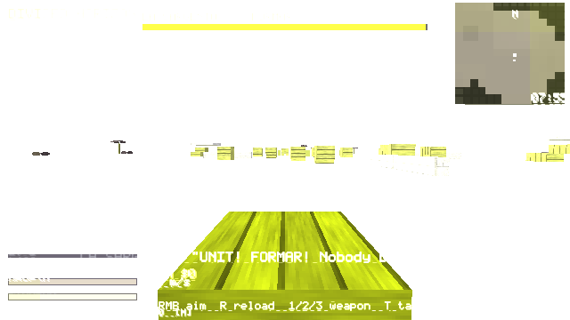

# M14 report — Boss B1 "La Sargento"

**What shipped**
- `game/src/game/boss.inl`: the boss framework (`Bosses` in `game.h`) plus the first boss.
- Start the fight by pressing **E** at the red war drum on the south edge of the combat yard (island).
- The cadence: while two drummers keep the beat, Marta takes only 10% of damage and her 4 shield-bearers take 20%. Killing a drummer staggers the unit for 4 s, and during the stagger they take full damage. Once both drummers are dead, the wall stays broken for the rest of that phase.
- The fight has 3 phases: P1 FORMAR (beat every 0.6 s), P2 CORREGIR (<66% health: drummers come back, 2 flankers join, faster 2-2-3 beat), P3 MAS FUERTE (<33% health: no drums, Marta moves faster, and her whistle stuns you for 0.8 s and does 8 damage within 10 m).
- When you win: the line "The unit... stands.", +500 XP, +5 stature, a Herald front page (new template `HT_BOSS`, `&` = boss name), and the surviving unit is cleared. Winning without dropping below 50% health unlocks the new feat **FORMAR** (27 feats now). Wins are saved, and rematches work. If you go down, the fight ends and counts as a loss.
- Engine: new `Enemy.armor` field (share of damage absorbed).
- Test: `game/tests/smoke_boss.c` (suite 13, 32 checks). All 13 suites pass. The Windows build and zip still build (380 KB).

**Differences from the spec**
- You break the drums by killing the drummers. There is no separate drum prop you can destroy.
- The rain and lightning staging is not built. Marta reuses the officer model. There is no voice acting.
- **Bosses 2–6 are not built.** `game_boss_start` refuses slots 1–5.

 (the headless render is washed out, as in earlier milestones)
