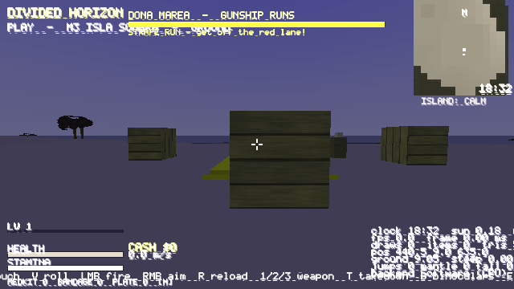
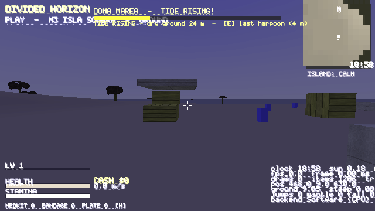

# M16 — Boss B3: Doña Marea

**Status:** done · 15 smoke suites, 956 checks passing · Windows exe PE-verified · zip built.

## What shipped
- **Trigger:** a harbour bell at the combat yard's north-west corner (E prompt; there's also a rematch prompt).
- **Sunset:** the fight forces the time to 18:30 (`game_set_time(0.52)`).
- **P1 GUNSHIP RUNS**
  - Every 9 s the gunship strafes a north-south lane for 2.5 s. Standing within 2.5 m of the lane costs 30 HP/s.
  - A red lane marker shows 2 s ahead of each run, and the lane moves between 5 positions.
  - After each run, a **4 s harpoon window** opens. Hold E at one of 3 fuel-line buoys to cut it (one cut per window).
  - Marea takes only 5% damage until all 3 lines are cut.
- **P2 PIER BRAWL:** the gunship sinks, Marea lands, and 2 deckhands join. Every 5 s an anchor-chain sweep (3 m) deals 15 damage and shoves you back.
- **P3 TIDE RISING (<33%):** the dry ground shrinks from 30 m to 10 m radius. Outside it you lose 10 HP/s. You get one last harpoon (E within 4 m) that deals 15% of her max HP.
- **Clean-win feat:** **LA AGUA CUSTODIA** (feat 29) for no strafe hits and never dropping below half health. The Herald names her, and the win is saved.

## Honest deviations (§19)
- The fight takes place in the land arena. There are no docks, water or drivable boats.
- The gunship, buoys, lane and tide ring are box markers.
- There's no fire, destructible pier geometry or voice (text barks only). Marea reuses the officer mesh.
- Bosses 4–6 are NOT built.

 
