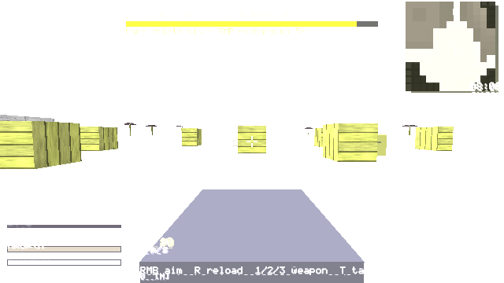
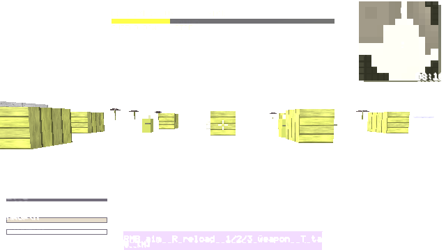

# M18 — Boss B5: El Limpiador

**Status:** done · 17 suites · 1012 checks passing · Win64 PE verified · zip rebuilt (392K).

## What shipped
- **Summon:** a police call-box prop in the combat yard at arena+(-16,-46). Press **E** to summon him, or to start a rematch.
- **P1 VAN PHALANX:** two Limpio vans (drawn as boxes) move between 4 cover points every 5 s. While they run he takes only 10% damage. Hack the **EMP node** (yellow pillar at the yard centre, **E**) to stall both vans for 6 s. While stalled he has 0% armour and the vans stay where they are. The node has a 12 s cooldown and shows a message while it recharges.
- **P2 LIMPIO WAVES (<66%):** 3 white-armoured elite grunts spawn with 50% armour. The vans and EMP still apply.
- **P3 CRANE (<33%):** the vans burn out. His riot shield stays up for 3 s (95% armour), then drops for 1.6 s, and you shoot him in that gap.
- **Down line:** "Report... the city is clean..."
- **Feat CIUDAD LIMPIA:** beat him without dropping below half health (clean_mask bit 4). There are now 31 feats.
- The HUD shows the vans' stall and EMP cooldown state and the shield state. Herald reports the kill.

## Where this differs from the design (honest)
- The fight takes place in the island combat yard, not Downtown Meridian at night.
- The vans are drawn boxes. You can't drive them and they don't ram.
- There is no tear gas.
- The spec's "no civilians down" condition is replaced by "never below 50% HP", because the arena has no civilians.
- Boss 6 (El Sereno) is **still not built**. Slot 6 still refuses to start.

## Tests
- `game/tests/smoke_limpiador.c` (suite 17, 29 checks) covers: the prompt, the summon, shield absorption, van repositioning, EMP stall and cooldown, vans holding position while stalled, vans restarting after the stall, the P2 elites, the P3 shield cycle and the damage gap, the down line, the clean feat, the herald report, a rematch that isn't clean, and the save round-trip.
- Tests that checked "slot 4 refuses" now check slot 5. The feats test now expects 31.
- A bug caught during development: the elites first used `flank[2]`, which overflowed into other memory. They now use `shield[4]`.

 

## Carried gaps
Boss 6, 11 of 12 outposts, drivable vehicles, SWAT, peds dying, voice and subtitles.
