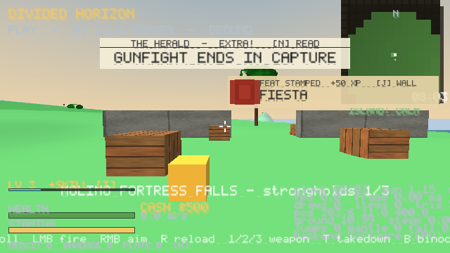

# M21 — Strongholds

## Delivered
- **3 strongholds** (§73 ST1–ST3) on Isla Sombra: **MOLINO FORTRESS** (west, mill chimney), **REFINERIA LA HERRERIA** (centre, tanks and pipe rack), **FARO VIEJO** (east, lighthouse).
- Each one has concrete curtain walls with a south gate, crate steps so you can climb the walls, two 5 m towers and a signature keep.
- **Multi-stage assault**: three garrison waves of 4, then 6, then 8 defenders. The final wave is led by an officer. A wave only marches in after the previous one is dead, and corpses are untagged so the census stays correct.
- After the last wave you hold the flag for **6 s** (camps take 3 s). Reward: +500 cash, +6 stature, loud-outpost XP and a 12-gauge ammo cache.
- Save/load: `camps_mask` bits 11–13, ids `stronghold_1..3`. All 15 SaveOutpost slots are now used.
- World map icons are larger (11 vs 7) and so are minimap icons (6 vs 4).
- `game_camp_count`, `game_camps_captured` and `game_outposts_total` still count camps only (12/12), so the stronghold totals stay separate.

## Numbers
- LOW props went from 450 to 493. World draws are unchanged at 125 because props are merged into the chunk meshes. I raised the island suite's prop ceiling from 480 to 540.
- Suite 20 `smoke_strongholds`: 20 checks. Total: 20 suites / 1083 checks, all green. The Windows PE is verified and the zip is 412K.

## Honest deviations
- **ST2 was specced for Meridian City.** Outside its block plate the city terrain is flattened to water, so there is no free lot. The refinery is on Isla Sombra instead, as the cartel's island refinery.
- Strongholds have no alarm mast or reinforcement calls yet; the waves are scripted. There are no vehicles in the assault either.

