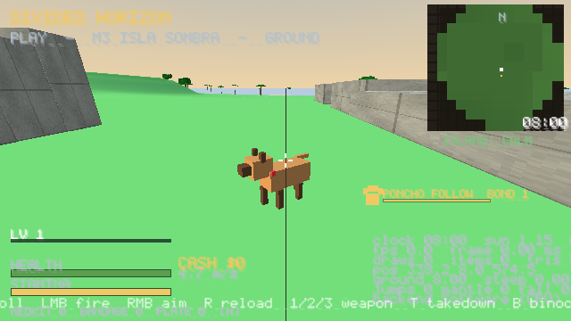

# M9 report — Soul pass (Poncho + Photo Mode)

**Status:** shipped, 758/758 headless checks (new suite 9: 51 checks). Exe 794,624 B, zip 356 KB.

## Delivered
### Poncho, the companion dog (`game/src/ai/dog.c`, `game/src/game/poncho.inl`)
- Found **snared by the spawn beach**; press **E** to free him.
- **O** cycles orders: HEEL → STAY → HUNT. **Aim + O** sends him at the guard under the crosshair (40 m max). He barks and pulls the nearest calm guard to SUSPICIOUS, and that guard's last-known position is the dog, not you.
- **HUNT:** he ranges ahead with his nose down. Pickups and game animals inside the sniff radius get gold scent beams, and the HUD counts them. The radius is 20 m, plus 2 m per bond level.
- **Bond:** pet him with E (20 s cooldown) to earn bond XP. There are 5 levels, and bond is saved.
- **He never dies.** Guards in COMBAT within 2.6 m wear him down, and at 0 HP he is knocked out. Hold **E** for 3 s next to him to revive him, or he gets up on his own after 30 s.
- **Teleport safety:** if he is lost for 6 s (over 28 m away) he is snapped behind you. The test checks that the worst case is 8 s or less. Changing act or fast travel (over 120 m) snaps him at once.
- New synthesised SFX: bark, collar jingle (plays while he runs), whine and camera shutter. A paw icon, status line and HP bar are on the HUD.
- Save flags: `poncho_freed`, `poncho_bond`, `poncho_cmd`, plus the `poncho_pets` stat.

### Photo mode (`game/src/game/photo.inl`)
- **P** freezes the simulation and gives you a free camera, tethered to 60 m and kept above the ground.
- **1/2** zoom. **R** cycles 6 filters: Natural, Golden Hour, Monsoon, Moonlight, Cinema (2.39:1), Postcard. **V** moves the time of day forward 1 h.
- **E/F** saves a PNG to `<user dir>/photos/dh_photo_NNNN.png`. The capture includes the scene and filter but not the hint bar. It works on both the soft renderer and GL (GL uses readback).

## Honest limits / not done
- Filters are colour overlays in the 2D pass. There is no real desaturation, depth of field or pose system.
- Poncho is built from boxes and animated in code (leg swing, tail wag, nose-down). There is no bite or takedown, no fetch, no swimming logic (he walks over the terrain height), and no pathfinding. The teleport safety net covers any case where he gets stuck.
- The E prompt can overlap with a vendor or safehouse E if you stand next to both.
- Still carried over: draw calls over budget; 1 of 12 outposts; no bosses or voice; mono audio; no subtitles; peds never die; box cars.
